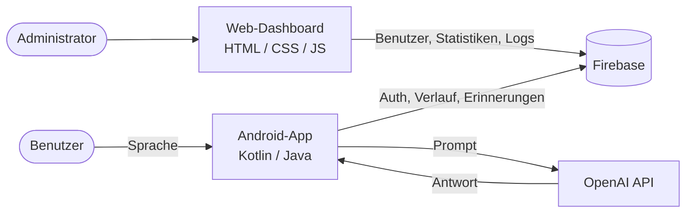
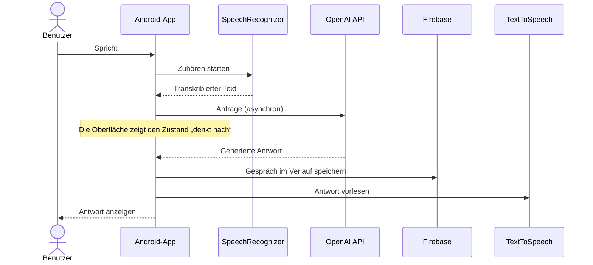
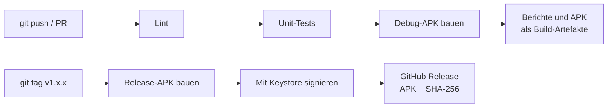

<div align="center">

# Alexandra — AI Voice Assistant

**Ein nativer Android-Sprachassistent, der zuhört, mit der OpenAI-API nachdenkt und laut antwortet — ergänzt durch ein Web-Dashboard zur Benutzerverwaltung.**

Abschlussprojekt (PFE) · 2026

[**🎥 Video-Demo**](https://youtu.be/TODO) · [**📸 Screenshots**](#screenshots) · [**🏗️ Architektur**](#architektur)

[](LICENSE)


[🇬🇧 English](README.md) · [🇩🇪 Deutsch](README.de.md)

</div>

<!-- TODO: 15-20 Sekunden langes GIF einer echten Sprachinteraktion (du sprichst, die App antwortet).
     Bildschirm mit dem Android-Bildschirmrekorder aufnehmen und konvertieren mit:
     ffmpeg -i demo.mp4 -vf "fps=12,scale=320:-1" docs/demo.gif -->
<p align="center">
  
</p>

---

## Inhaltsverzeichnis

- [Überblick](#überblick)
- [Was dieses Projekt zeigt](#was-dieses-projekt-zeigt)
- [Funktionen](#funktionen)
- [Screenshots](#screenshots)
- [Architektur](#architektur)
- [Technologie-Stack](#technologie-stack)
- [Erste Schritte](#erste-schritte)
- [Konfiguration](#konfiguration)
- [Tests](#tests)
- [Projektstruktur](#projektstruktur)
- [Sicherheit](#sicherheit)
- [Technische Herausforderungen und Erkenntnisse](#technische-herausforderungen-und-erkenntnisse)
- [Roadmap](#roadmap)
- [Autor](#autor)
- [Lizenz](#lizenz)

---

## Überblick

Alexandra ist ein durchgängiger Sprachassistent. Der Benutzer spricht mit der Android-App, die Sprache wird auf dem Gerät transkribiert, der Text wird an die OpenAI-API gesendet, und die Antwort wird angezeigt und laut vorgelesen. Unterhaltungen werden pro Benutzer gespeichert, damit sie später nachgelesen werden können.

Das Projekt deckt den gesamten Stack ab und nicht nur eine einzelne Schicht:

| Komponente | Rolle |
|---|---|
| **Android-App** (Kotlin / Java) | Spracherfassung, Unterhaltungsoberfläche, Erinnerungen, Benachrichtigungen, Benutzerprofil |
| **Firebase** | Benutzerauthentifizierung und Datenspeicherung |
| **OpenAI-API** | Konversationelle Intelligenz |
| **Web-Dashboard** (HTML / CSS / JS) | Benutzerverwaltung und Nutzungsübersicht für Administratoren |
| **GitHub Actions** | Automatisiertes Linting, Testen, Bauen und signierte APK-Releases |

---

## Was dieses Projekt zeigt

Für alle, die dieses Repository begutachten, zeigt es in der Praxis Folgendes:

- **Native Android-Entwicklung** mit Kotlin und Java, einschließlich Laufzeitberechtigungen, Spracherkennung und Text-to-Speech
- **Integration von Drittanbieter-APIs** mit asynchronen Aufrufen, die den UI-Thread nie blockieren
- **Authentifizierung und Persistenz** mit Firebase
- **Full-Stack-Umfang**: ein mobiler Client *und* eine Web-Oberfläche zur Administration
- **Ingenieurmäßige Disziplin**: CI bei jedem Push, signierte und versionierte Releases, Abhängigkeits-Updates über Dependabot, Geheimnisse außerhalb der Versionsverwaltung
- **Ehrliche technische Einschätzung**: bekannte Einschränkungen und Kompromisse sind unter [Sicherheit](#sicherheit) und [Roadmap](#roadmap) dokumentiert und nicht verborgen

---

## Funktionen

### Mobile Anwendung

- **Spracherkennung** — freihändige Interaktion mit Androids `SpeechRecognizer`
- **KI-Unterhaltung** — Antworten, die über die OpenAI-API generiert werden
- **Gesprochene Antworten** — Antworten werden mit Android Text-to-Speech vorgelesen
- **Unterhaltungsverlauf** — vergangene Gespräche werden pro Benutzer gespeichert
- **Erinnerungen und Aufgaben** — Erinnerungen per Sprache erstellen und verwalten
- **Intelligente Benachrichtigungen** — Hinweise zum richtigen Zeitpunkt
- **Authentifizierung** — Registrierung, Anmeldung und ein Profilbildschirm
- **Berechtigungsablauf** — ein eigener Bildschirm, der den Mikrofonzugriff erklärt und anfordert

### Web-Dashboard

- **Benutzerverwaltung** — Benutzer hinzufügen, bearbeiten und löschen
- **Statistiken** — Übersicht über die App-Nutzung
- **Sichere Anmeldung** — geschützter Administrator-Zugang
- **Aktivitätsprotokoll** — Nachvollziehbarkeit der Benutzeraktionen

---

## Screenshots

### Mobile Anwendung

<table>
  <tr>
    <td align="center"><br /><sub>Startseite</sub></td>
    <td align="center"><br /><sub>Verlauf</sub></td>
    <td align="center"><br /><sub>Profil</sub></td>
  </tr>
  <tr>
    <td align="center"><br /><sub>Anmeldung</sub></td>
    <td align="center"><br /><sub>Registrierung</sub></td>
    <td align="center"><br /><sub>Berechtigungen</sub></td>
  </tr>
</table>

### Web-Dashboard

| Admin | Benutzer | Anmeldung |
|---|---|---|
|  |  |  |

---

## Architektur

### Systemübersicht



### Ablauf der Sprachinteraktion



### Auslieferungs-Pipeline



---

## Technologie-Stack

| Schicht | Technologie | Zweck |
|---|---|---|
| Mobil | Kotlin, Java | Hauptanwendung; Java für Legacy-Module beibehalten |
| Sprache | Android `SpeechRecognizer`, `TextToSpeech` | Speech-to-Text und Text-to-Speech auf dem Gerät |
| KI | OpenAI API | Konversationelle Antworten |
| Backend | Firebase Authentication, Firebase-Datenbank | Benutzer, Sitzungen, Verlauf |
| Dashboard | HTML, CSS, JavaScript | Administrationsoberfläche |
| Build | Gradle (Kotlin DSL) | Build- und Abhängigkeitsverwaltung |
| CI/CD | GitHub Actions, Dependabot | Automatisierte Prüfungen, Releases, Abhängigkeits-Updates |

---

## Erste Schritte

### Voraussetzungen

- **Android Studio** — aktuelle stabile Version
- **JDK 17**
- Ein Android-Gerät oder Emulator mit **Android TODO+** (API TODO)
- Ein **Firebase**-Projekt (der kostenlose Spark-Tarif genügt)
- Ein **OpenAI-API-Schlüssel**

### 1. Repository klonen

```bash
git clone https://github.com/El-Tousy/alexandra-voice-assistant.git
cd alexandra-voice-assistant
```

### 2. Firebase konfigurieren

1. Erstelle ein Projekt in der [Firebase-Konsole](https://console.firebase.google.com/).
2. Füge eine Android-App mit dem Paketnamen hinzu, der in `android_studio_codes/app/build.gradle.kts` steht (`applicationId`).
3. Aktiviere **Authentication** (E-Mail/Passwort) und erstelle die Datenbank (TODO: Firestore oder Realtime Database).
4. Lade `google-services.json` herunter und lege sie hier ab:

   ```
   android_studio_codes/app/google-services.json
   ```

   Diese Datei steht in der `.gitignore` und darf niemals committet werden.

### 3. OpenAI-Schlüssel hinzufügen

Füge den Schlüssel in `android_studio_codes/local.properties` ein (ebenfalls in der `.gitignore`):

```properties
OPENAI_API_KEY=sk-your-key-here
```

<!-- TODO: Diesen Abschnitt anpassen, sodass er dazu passt, wie die App den Schlüssel tatsächlich liest. -->

### 4. App starten

Öffne `android_studio_codes/` in Android Studio, warte auf die Gradle-Synchronisierung und klicke auf **Run**. Oder über die Kommandozeile:

```bash
cd android_studio_codes
./gradlew installDebug
```

Beim ersten Start fragt die App nach der Mikrofonberechtigung.

### 5. Dashboard starten (optional)

Das Dashboard ist statisch. Im Hauptverzeichnis des Repositorys:

```bash
npx serve dashboard_pages
```

Öffne anschließend `http://localhost:3000/login.html`. <!-- TODO: angeben, wo die Firebase-Web-Konfiguration gesetzt wird und wie das erste Admin-Konto erstellt wird. -->

### Ohne Build ausprobieren

Lade die neueste signierte APK von der [Releases-Seite](https://github.com/El-Tousy/alexandra-voice-assistant/releases/latest) herunter und prüfe ihre Integrität:

```bash
sha256sum -c alexandra-vX.Y.Z.apk.sha256
```

---

## Konfiguration

In diesem Repository werden keine sensiblen Daten gespeichert.

| Element | Zweck | Speicherort | Committet |
|---|---|---|---|
| `google-services.json` | Firebase-Projektkonfiguration | `android_studio_codes/app/` | Nein |
| `OPENAI_API_KEY` | Authentifizierung bei OpenAI | `android_studio_codes/local.properties` | Nein |
| Release-Keystore | Signiert die Release-APK | GitHub-Actions-Secret | Nein |

---

### Ein Release veröffentlichen

```bash
git tag v1.0.0
git push origin v1.0.0
```

<details>
<summary><b>Einmalige Einrichtung: Signatur-Secrets</b></summary>

Erzeuge einen Keystore (bewahre ihn außerhalb des Repositorys auf und lege eine Sicherung an — ohne ihn kannst du die App nie mehr mit derselben Signatur aktualisieren):

```bash
keytool -genkeypair -v -keystore release.keystore -alias alexandra \
  -keyalg RSA -keysize 2048 -validity 10000
```

Kodiere ihn und füge vier Secrets unter **Settings → Secrets and variables → Actions** hinzu:

```bash
base64 -w0 release.keystore
```

| Secret | Wert |
|---|---|
| `KEYSTORE_BASE64` | Ausgabe des obigen Befehls |
| `KEYSTORE_PASSWORD` | Keystore-Passwort |
| `KEY_ALIAS` | `alexandra` |
| `KEY_PASSWORD` | Schlüsselpasswort |

</details>

---

## Tests

```bash
cd android_studio_codes
./gradlew testDebugUnitTest   # Unit-Tests
./gradlew lintDebug           # statische Analyse
```

<!-- TODO: Die tatsächliche Testabdeckung angeben. Falls es noch keine Tests gibt, die folgende Zeile
     beibehalten und Tests in die Roadmap aufnehmen, statt eine Abdeckung zu behaupten, die es nicht gibt. -->
Beide Befehle laufen bei jedem Push und jedem Pull Request automatisch.

---

## Projektstruktur

```
alexandra-voice-assistant/
│
├── android_studio_codes/        # Android-Projekt
│   ├── app/
│   │   └── src/main/
│   │       ├── java/            # Kotlin- und Java-Quellcode
│   │       ├── res/             # Layouts, Drawables, Farben, Menüs, Werte
│   │       └── AndroidManifest.xml
│   ├── build.gradle.kts
│   └── settings.gradle.kts
│
├── dashboard_pages/             # Web-Oberfläche zur Administration
│   ├── dashboard-admin.html
│   ├── dashboard-user.html
│   └── login.html
│
├── docs/                        # Demo-GIF
├── screenshots/
│   ├── app/
│   └── dashboard/
│
├── LICENSE
└── README.md
```

---

## Sicherheit

- **Geheimnisse bleiben aus Git heraus.** Der OpenAI-Schlüssel und `google-services.json` sind vom Repository ausgeschlossen und werden lokal oder über CI-Secrets bereitgestellt.
- **Signierte, überprüfbare Releases.** Release-APKs werden mit einem privaten Keystore signiert, der als verschlüsseltes GitHub-Secret gespeichert ist, und zusammen mit einer SHA-256-Prüfsumme veröffentlicht.
- **Minimale Rechte in der CI.** Workflows fordern nur die Berechtigungen an, die sie benötigen.

### Bekannte Einschränkung: Der OpenAI-Schlüssel liegt im Client

Ein in eine Android-App eingebetteter Schlüssel kann von jedem ausgelesen werden, der die APK entpackt. Für die lokale Entwicklung ist das akzeptabel, für einen öffentlichen Build jedoch **nicht**: Öffentlich verteilte APKs werden deshalb **ohne** echten Schlüssel gebaut.

Die produktionsreife Lösung ist, den Schlüssel auf einem Server aufzubewahren und die App diesen Server aufrufen zu lassen. Das steht auf der [Roadmap](#roadmap): eine Firebase Cloud Function als authentifizierter Proxy, damit der Schlüssel das Backend nie verlässt und Anfragen pro Benutzer begrenzt werden können.

---

## Technische Herausforderungen und Erkenntnisse

- **Echtzeit-Koordination.** Die kontinuierliche Spracherkennung musste neben den Netzwerkaufrufen an die OpenAI-API laufen, ohne jemals den UI-Thread zu blockieren. Das erforderte eine klare Trennung zwischen dem Zuhör-, dem Warte- und dem Sprechzustand.

- **API-Latenz.** Ein Aufruf eines Sprachmodells dauert Sekunden. Ohne Rückmeldung glauben Benutzer, die App sei eingefroren, daher zeigt die Oberfläche einen eindeutigen Zustand „denkt nach“, bis die Antwort eintrifft.

- **Zwei Sprachen in einer Codebasis.** Kotlin und Java koexistieren, mit Legacy-Modulen neben neuerem Code. Die Interoperabilität sauber zu halten (Nullability, Callbacks, Coroutines gegenüber Threads) war eine praktische Lektion in schrittweiser Migration.

- **Verwaltung von Geheimnissen.** Den OpenAI-Schlüssel und die Firebase-Konfiguration aus dem Repository herauszuhalten, hat sowohl die lokale Einrichtung als auch das CI-Design geprägt — und dazu geführt, die oben beschriebene Einschränkung des Schlüssels im Client zu erkennen.

- **Automatisierung der Auslieferung.** Beim Aufbau der CI/CD-Pipeline musste der Build ohne Geheimnisse reproduzierbar gemacht und ein sicherer Weg gefunden werden, eine APK auf einem CI-Runner zu signieren.

---

## Roadmap

- [x] Spracherkennung und KI-Unterhaltung
- [x] Firebase-Authentifizierung und Verlauf
- [x] Web-Administrations-Dashboard
- [x] CI: Lint, Test und Build bei jedem Push
- [x] Signierte APK-Releases bei Versions-Tags
- [ ] OpenAI-Aufrufe hinter eine Firebase Cloud Function verlagern
- [ ] Unit-Tests für die Unterhaltungs- und Erinnerungslogik
- [ ] Dashboard bereitstellen (Firebase Hosting oder GitHub Pages) mit Live-Link
- [ ] Migration der Java-Legacy-Module nach Kotlin abschließen
- [ ] Mehrsprachige Sprachunterstützung (Arabisch, Französisch, Englisch)
- [ ] Offline-Verhalten und Fehlerbehandlung bei Netzwerkausfall

---

## Autor

**El_Tousy** — Informatikstudent

[](https://github.com/El-Tousy)
[](mailto:leilaeltousy@gmail.com)

---

## Lizenz

Veröffentlicht unter der MIT-Lizenz. Details siehe [LICENSE](LICENSE).

---

<div align="center">

⭐ Wenn dir dieses Projekt gefällt, freue ich mich über einen Stern.

</div>
