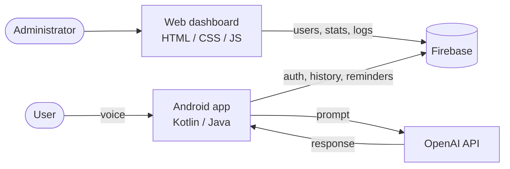
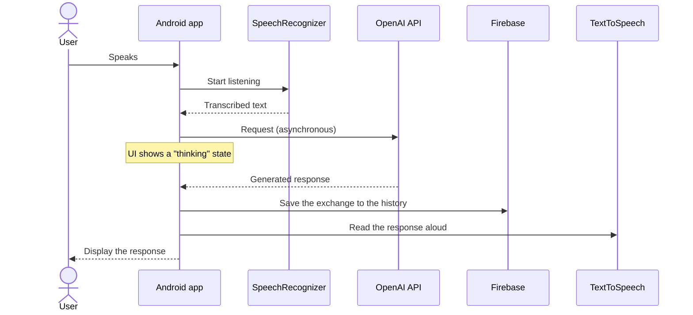
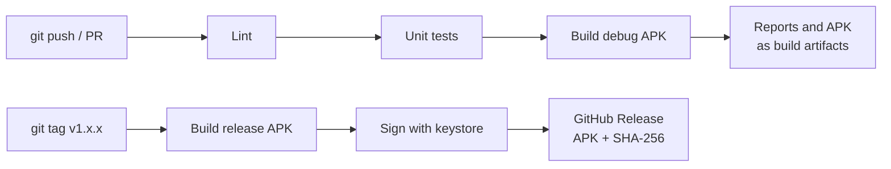

<div align="center">

# Alexandra — AI Voice Assistant

**A native Android voice assistant that listens, thinks with the OpenAI API and answers out loud — paired with a web dashboard for user management.**

Final Year Project (PFE) · 2026

[**🎥 Video Demo**](https://youtu.be/TODO) · [**📦 Download APK**](https://github.com/El-Tousy/alexandra-voice-assistant/releases/latest) · [**📸 Screenshots**](#screenshots) · [**🏗️ Architecture**](#architecture)

[](https://github.com/El-Tousy/alexandra-voice-assistant/actions/workflows/android-ci.yml)
[](https://github.com/El-Tousy/alexandra-voice-assistant/releases)
[](LICENSE)


</div>

<!-- TODO: 15-20s GIF of a real voice interaction (you speaking, the app answering).
     Record the screen with the Android built-in recorder, convert with:
     ffmpeg -i demo.mp4 -vf "fps=12,scale=320:-1" docs/demo.gif -->
<p align="center">
  
</p>

---

## Table of Contents

- [Overview](#overview)
- [What this project demonstrates](#what-this-project-demonstrates)
- [Features](#features)
- [Screenshots](#screenshots)
- [Architecture](#architecture)
- [Tech Stack](#tech-stack)
- [Getting Started](#getting-started)
- [Configuration](#configuration)
- [CI/CD](#cicd)
- [Testing](#testing)
- [Project Structure](#project-structure)
- [Security](#security)
- [Technical Challenges and Learnings](#technical-challenges-and-learnings)
- [Roadmap](#roadmap)
- [Author](#author)
- [License](#license)

---

## Overview

Alexandra is an end-to-end voice assistant. A user speaks to the Android app, the speech is transcribed on the device, the text is sent to the OpenAI API, and the answer is displayed and read back aloud. Conversations are stored per user so they can be reviewed later.

The project covers the full stack rather than a single layer:

| Component | Role |
|---|---|
| **Android app** (Kotlin / Java) | Voice capture, conversation UI, reminders, notifications, user profile |
| **Firebase** | User authentication and data storage |
| **OpenAI API** | Conversational intelligence |
| **Web dashboard** (HTML / CSS / JS) | User management and usage overview for administrators |
| **GitHub Actions** | Automated lint, test, build and signed APK releases |

---

## What this project demonstrates

For anyone reviewing this repository, here is what it shows in practice:

- **Native Android development** with Kotlin and Java, including runtime permissions, speech recognition and text-to-speech
- **Third-party API integration** with asynchronous calls that never block the UI thread
- **Authentication and persistence** with Firebase
- **Full-stack scope**: a mobile client *and* an administration web interface
- **Engineering discipline**: CI on every push, signed and versioned releases, dependency updates through Dependabot, secrets kept out of version control
- **Honest technical judgement**: known limitations and trade-offs are documented in [Security](#security) and [Roadmap](#roadmap), not hidden

---

## Features

### Mobile application

- **Voice recognition** — hands-free interaction using Android's `SpeechRecognizer`
- **AI conversation** — responses generated through the OpenAI API
- **Spoken answers** — replies read aloud with Android text-to-speech
- **Conversation history** — past exchanges stored per user
- **Reminders and tasks** — create and manage reminders by voice
- **Smart notifications** — alerts delivered at the right moment
- **Authentication** — sign up, log in, and a profile screen
- **Permission flow** — a dedicated screen explaining and requesting microphone access

### Web dashboard

- **User management** — add, edit and delete users
- **Statistics** — app usage overview
- **Secure login** — protected administrator access
- **Activity log** — traceability of user actions

---

## Screenshots

### Mobile application

<table>
  <tr>
    <td align="center"><br /><sub>Home</sub></td>
    <td align="center"><br /><sub>History</sub></td>
    <td align="center"><br /><sub>Profile</sub></td>
  </tr>
  <tr>
    <td align="center"><br /><sub>Login</sub></td>
    <td align="center"><br /><sub>Sign up</sub></td>
    <td align="center"><br /><sub>Permissions</sub></td>
  </tr>
</table>

### Web dashboard

| Admin | User | Login |
|---|---|---|
|  |  |  |

---

## Architecture

### System overview



### Voice interaction flow



### Delivery pipeline



---

## Tech Stack

| Layer | Technology | Purpose |
|---|---|---|
| Mobile | Kotlin, Java | Main application; Java kept for legacy modules |
| Voice | Android `SpeechRecognizer`, `TextToSpeech` | On-device speech-to-text and text-to-speech |
| AI | OpenAI API | Conversational responses |
| Backend | Firebase Authentication, Firebase database | Users, sessions, history |
| Dashboard | HTML, CSS, JavaScript | Administration interface |
| Build | Gradle (Kotlin DSL) | Build and dependency management |
| CI/CD | GitHub Actions, Dependabot | Automated checks, releases, dependency updates |

---

## Getting Started

### Prerequisites

- **Android Studio** — recent stable version
- **JDK 17**
- An Android device or emulator running **Android TODO+** (API TODO)
- A **Firebase** project (free Spark plan is enough)
- An **OpenAI API key**

### 1. Clone the repository

```bash
git clone https://github.com/El-Tousy/alexandra-voice-assistant.git
cd alexandra-voice-assistant
```

### 2. Configure Firebase

1. Create a project in the [Firebase console](https://console.firebase.google.com/).
2. Add an Android app using the package name found in `android_studio_codes/app/build.gradle.kts` (`applicationId`).
3. Enable **Authentication** (Email/Password) and create the database (TODO: Firestore or Realtime Database).
4. Download `google-services.json` and place it in:

   ```
   android_studio_codes/app/google-services.json
   ```

   This file is git-ignored and must never be committed.

### 3. Add your OpenAI key

Add the key to `android_studio_codes/local.properties` (also git-ignored):

```properties
OPENAI_API_KEY=sk-your-key-here
```

<!-- TODO: adjust this section to match how the app really reads the key. -->

### 4. Run the app

Open `android_studio_codes/` in Android Studio, let Gradle sync, then press **Run**. Or from the command line:

```bash
cd android_studio_codes
./gradlew installDebug
```

On first launch, the app asks for microphone permission.

### 5. Run the dashboard (optional)

The dashboard is static. From the repository root:

```bash
npx serve dashboard_pages
```

Then open `http://localhost:3000/login.html`. <!-- TODO: state where the Firebase web config is set and how to create the first admin account. -->

### Try it without building

Download the latest signed APK from the [Releases page](https://github.com/El-Tousy/alexandra-voice-assistant/releases/latest) and verify its integrity:

```bash
sha256sum -c alexandra-vX.Y.Z.apk.sha256
```

---

## Configuration

Nothing sensitive is stored in this repository.

| Item | Purpose | Location | Committed |
|---|---|---|---|
| `google-services.json` | Firebase project configuration | `android_studio_codes/app/` | No |
| `OPENAI_API_KEY` | OpenAI authentication | `android_studio_codes/local.properties` | No |
| Release keystore | Signs the release APK | GitHub Actions secret | No |

---

## CI/CD

Two workflows run on GitHub Actions. Neither ever has access to a real API key: builds use generated placeholders.

| Workflow | Trigger | What it does |
|---|---|---|
| [`android-ci.yml`](.github/workflows/android-ci.yml) | Push or pull request on `main` | Lint → unit tests → debug build → uploads reports and the debug APK as artifacts |
| [`release.yml`](.github/workflows/release.yml) | Push of a tag `vX.Y.Z` | Builds the release APK → aligns and signs it → computes a SHA-256 checksum → publishes a GitHub Release with generated notes |

Practices applied:

- **Least-privilege permissions** — the CI workflow is read-only; only the release workflow can write
- **Concurrency control** — superseded runs are cancelled automatically
- **Dependency caching** for faster builds
- **Dependabot** — weekly updates for Gradle dependencies and Actions versions
- **Reports uploaded on failure**, so a red build can be diagnosed without re-running it locally
- **Verifiable releases** — every APK ships with a checksum

### Publishing a release

```bash
git tag v1.0.0
git push origin v1.0.0
```

<details>
<summary><b>One-time setup: signing secrets</b></summary>

Generate a keystore (keep it outside the repository and back it up — losing it means you can never update the app under the same signature):

```bash
keytool -genkeypair -v -keystore release.keystore -alias alexandra \
  -keyalg RSA -keysize 2048 -validity 10000
```

Encode it and add four secrets under **Settings → Secrets and variables → Actions**:

```bash
base64 -w0 release.keystore
```

| Secret | Value |
|---|---|
| `KEYSTORE_BASE64` | Output of the command above |
| `KEYSTORE_PASSWORD` | Keystore password |
| `KEY_ALIAS` | `alexandra` |
| `KEY_PASSWORD` | Key password |

</details>

---

## Testing

```bash
cd android_studio_codes
./gradlew testDebugUnitTest   # unit tests
./gradlew lintDebug           # static analysis
```

<!-- TODO: state the real test coverage. If there are no tests yet, keep the line below
     and add tests to the roadmap rather than claiming coverage you do not have. -->
Both commands run automatically on every push and pull request.

---

## Project Structure

```
alexandra-voice-assistant/
│
├── .github/
│   ├── workflows/
│   │   ├── android-ci.yml       # Lint, test, build
│   │   └── release.yml          # Signed APK release on tag
│   └── dependabot.yml
│
├── android_studio_codes/        # Android project
│   ├── app/
│   │   └── src/main/
│   │       ├── java/            # Kotlin and Java sources
│   │       ├── res/             # Layouts, drawables, colors, menus, values
│   │       └── AndroidManifest.xml
│   ├── build.gradle.kts
│   └── settings.gradle.kts
│
├── dashboard_pages/             # Administration web interface
│   ├── dashboard-admin.html
│   ├── dashboard-user.html
│   └── login.html
│
├── docs/                        # Demo GIF and extra documentation
├── screenshots/
│   ├── app/
│   └── dashboard/
│
├── LICENSE
└── README.md
```

---

## Security

- **Secrets stay out of Git.** The OpenAI key and `google-services.json` are excluded from the repository and provided locally or through CI secrets.
- **Signed, verifiable releases.** Release APKs are signed with a private keystore stored as an encrypted GitHub secret, and published with a SHA-256 checksum.
- **Least privilege in CI.** Workflows request only the permissions they need.

### Known limitation: the OpenAI key lives in the client

A key embedded in an Android app can be extracted by anyone who unpacks the APK. That is acceptable for local development, but it is **not** acceptable for a public build: publicly distributed APKs are therefore built **without** a real key.

The production-grade design is to keep the key on a server and have the app call that server instead. This is on the [roadmap](#roadmap): a Firebase Cloud Function acting as an authenticated proxy, so the key never leaves the backend and requests can be rate-limited per user.

---

## Technical Challenges and Learnings

- **Real-time coordination.** Continuous speech recognition had to coexist with network calls to the OpenAI API without ever blocking the UI thread. This required a clear separation between the listening state, the waiting state and the speaking state.

- **API latency.** A language-model call takes seconds. Without feedback, users assume the app has frozen, so the UI shows an explicit "thinking" state until the response arrives.

- **Two languages in one codebase.** Kotlin and Java coexist, with legacy modules alongside newer code. Keeping interoperability clean (nullability, callbacks, coroutines versus threads) was a practical lesson in incremental migration.

- **Secret management.** Keeping the OpenAI key and Firebase configuration out of the repository shaped both the local setup and the CI design — and led to identifying the client-side key limitation described above.

- **Automating delivery.** Building the CI/CD pipeline meant making the build reproducible without secrets, and working out how to sign an APK safely from a CI runner.

---

## Roadmap

- [x] Voice recognition and AI conversation
- [x] Firebase authentication and history
- [x] Web administration dashboard
- [x] CI: lint, test, build on every push
- [x] Signed APK releases on version tags
- [ ] Move OpenAI calls behind a Firebase Cloud Function
- [ ] Unit tests for the conversation and reminder logic
- [ ] Deploy the dashboard (Firebase Hosting or GitHub Pages) with a live link
- [ ] Complete the migration of legacy Java modules to Kotlin
- [ ] Multilingual voice support (Arabic, French, English)
- [ ] Offline handling and error recovery when the network drops

---

## Author

**TODO: Your Name** — Computer Science student

[](https://github.com/El-Tousy)
[](https://linkedin.com/in/TODO)
[](mailto:leilaeltousy@gmail.com)

---

## License

Distributed under the MIT License. See [LICENSE](LICENSE) for details.

---

<div align="center">

⭐ If you find this project useful, consider leaving a star.

</div>
